# Secure Microsoft 365 Digital Office for a Global Bank

## Overview
Self-guided lab project simulating the creation of a professional, secure Microsoft 365 environment for a fictional global bank. This hands-on exercise demonstrates building a "digital office" from scratch, ensuring safe access for employees worldwide via features like branding, identity management, device compliance, data protection, and Zero Trust security.

**Objective**: Establish a secure setup using Microsoft Admin Center, focusing on security layers to protect against threats like phishing and unauthorized access.

**Key Skills Demonstrated**:
- Microsoft 365 administration (branding, licensing, tenant setup)
- Entra ID identity and access management (users, groups, Conditional Access, MFA)
- SharePoint Online for secure collaboration
- Intune for device compliance and enrollment (Windows/Android)
- Purview for information protection (sensitivity labels, DLP basics)
- Defender for Endpoint integration and risk-based policies
- PowerShell automation via Microsoft Graph for auditing

**Tools/Services Used**: Microsoft 365 E5 trial, Entra ID, Intune, SharePoint, Purview, Defender for Endpoint, PowerShell.

**Note**: Applying 5+ years of IT support experience to Azure/M365 through targeted self-guided projects. All steps performed in a test tenant – no production data or real deployments. Aligns with roles involving M365 optimizations, migrations, and security (e.g., Intune/Defender setups).

## Phases and Implementation Summary

### Phase 1: Building the Foundation
- Custom company branding (professional login background for phishing resistance)
- Activated Microsoft 365 E5 licensing
- Updated tenant name to "Global Bank Project" and added technical contact

### Phase 2: User and Group Management
- Created Finance Manager user and additional test users
- Created "Finance Department" security group (least privilege applied)
- Added members to group

### Phase 3: MFA and Conditional Access
- Implemented Conditional Access policy requiring MFA for Finance Department
- Verified MFA enforcement in Incognito login

### Phase 4: SharePoint "Vault" Setup
- Created private Team site ("Global Bank Finance Portal")
- Linked to Finance Department group
- Troubleshot SharePoint service enablement if needed

### Phase 5: Device Compliance Policies
- Created Windows and Android compliance policies (BitLocker, encryption, password rules, antivirus, etc.)
- Assigned policies to Finance Department group

### Phase 6: Device Enrollment and App Deployment
- Connected Managed Google Play
- Enrolled Samsung S23 with work profile
- Deployed Microsoft Teams as required app
- Verified compliance and app installation on device

### Phase 7: Zero Trust Security (Purview + Defender)
- Created "Bank Confidential" sensitivity label with encryption, permissions, and watermarks
- Published label policy and verified in mobile Word app
- Enabled Defender for Endpoint – Intune integration
- Created risk-based compliance policy and deployed Defender app
- Verified "Compliant" status and no threats

### Phase 8: Privileged Identity Management (PIM) – Just-in-Time Privileged Access (Advanced Extension)

This phase builds on the Zero Trust identity foundation by implementing Privileged Identity Management (PIM) for the Security Administrator role. PIM enforces just-in-time (JIT) access: admins can only activate privileged roles temporarily when needed, with MFA, justification, and automatic expiration — reducing standing privileged accounts in a global banking environment.

#### Role Settings Configuration
Configured PIM role settings for Security Administrator with bank-grade security controls:

- **Activation**:
  - Maximum duration: 4 hours (temporary access only)
  - Require Azure MFA on activation: Yes
  - Require justification on activation: Yes
  - Require approval: No (for lab simplicity; can be added in production)

- **Assignment**:
  - Allow permanent eligible assignments: Yes
  - No permanent active assignments (prevents standing privileges)

- **Notification**:
  - Enabled alerts for assignments, activations, and renewals to admins and assignees

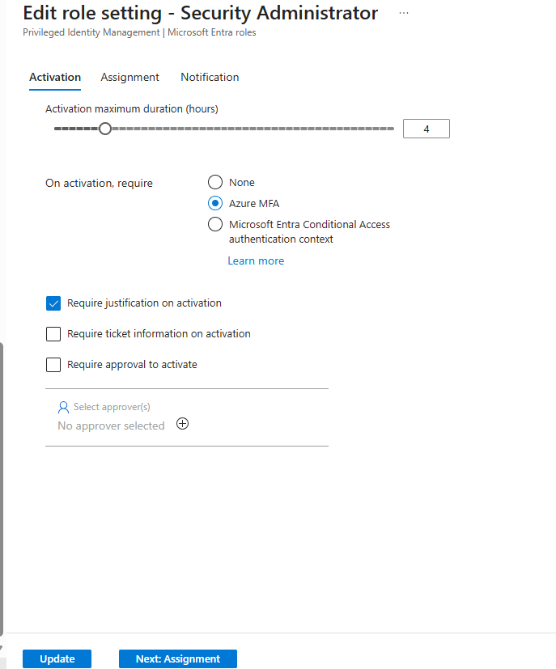

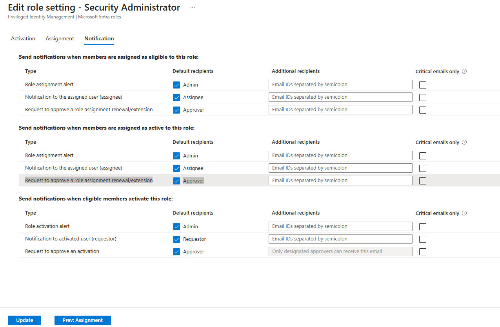

#### Eligible Assignment
Assigned the Security Administrator role as **Eligible** to a dedicated test privileged user (`securityadmin@Cyber344.onmicrosoft.com`).  
This enables just-in-time activation without giving permanent standing privileges.

Key steps documented:
- Opening the Add assignments pane
- Selecting the test user
- Configuring Eligible assignment type
- Confirmation of success
- Final updated Eligible assignments list

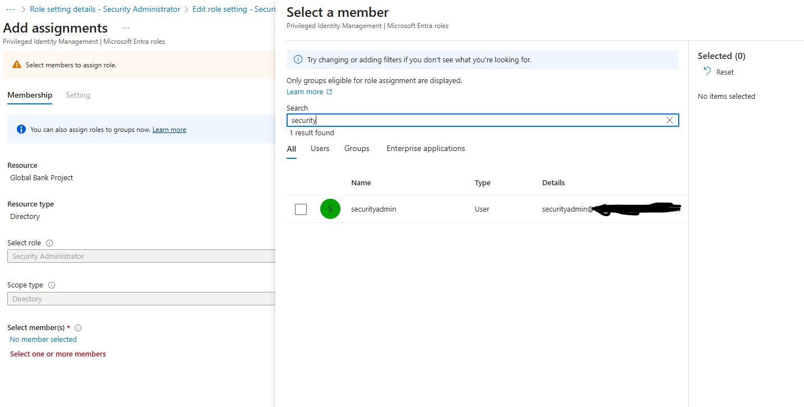
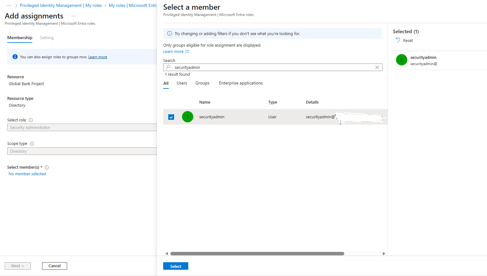
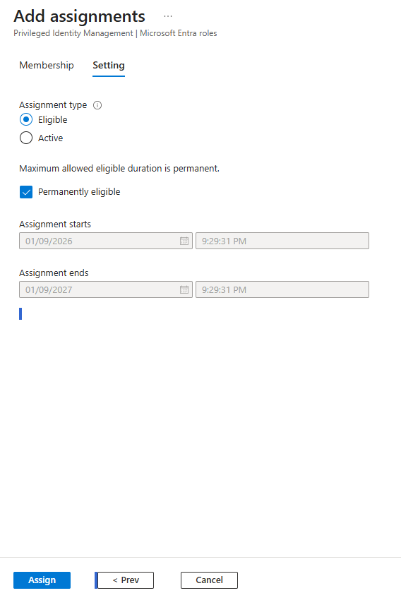
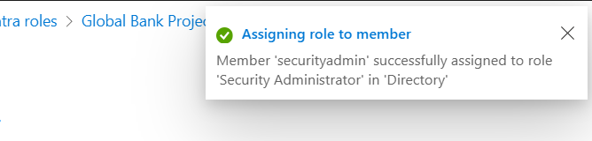
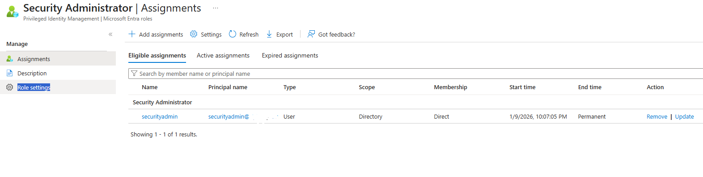
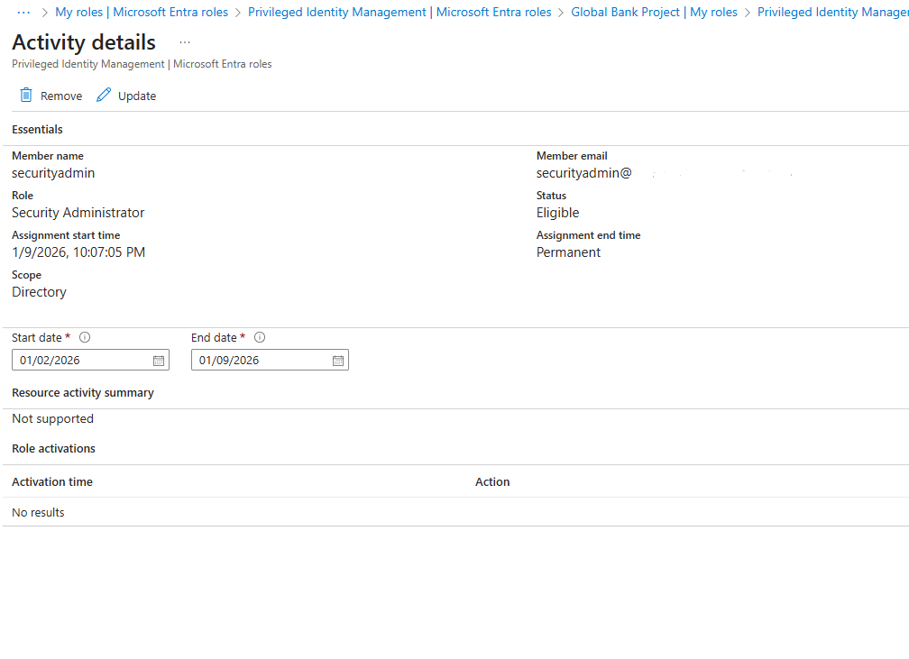

#### Activation as Test User
As the eligible test user, I signed in to the Entra portal and activated the Security Administrator role just-in-time (JIT):

- Viewed the eligible role in My roles
- Requested activation with justification and MFA
- Confirmed successful temporary activation (role shows as Active with expiration in 2 hours)

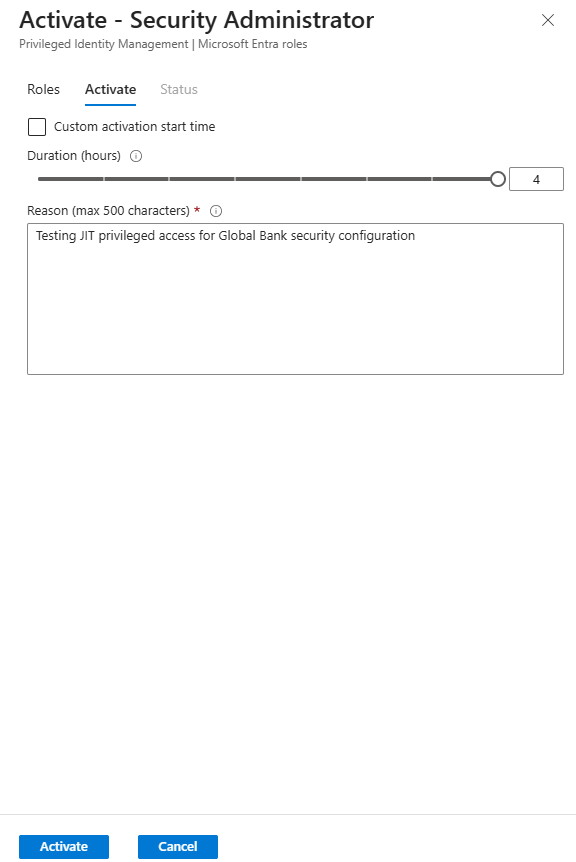
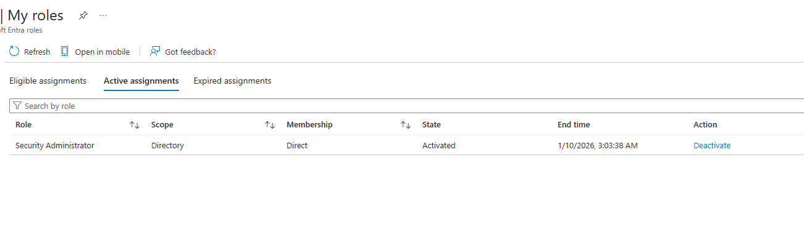

#### Key Learnings & Design Decisions
- Implemented JIT access for privileged roles to enforce least privilege and reduce risk of standing admin accounts.
- Integrated MFA and justification requirements, aligning with existing Conditional Access policies.
- Used permanent eligible assignment for realistic ongoing admin use, with short activation duration (2 hours) for automatic revocation.
- This extension strengthens the overall Zero Trust posture of the Global Bank digital office.

## Challenges and Troubleshooting
- Group sync delays (Entra/SharePoint) – resolved with individual adds
- Defender/Intune connection propagation – fixed by enabling plans and waiting
- Managed Google Play timeout – used limited account option

## Key Learnings
- Integrated multiple M365 security services end-to-end
- Applied troubleshooting skills from IT support to cloud scenarios
- Produced structured documentation suitable for handover

## Verification Screenshots
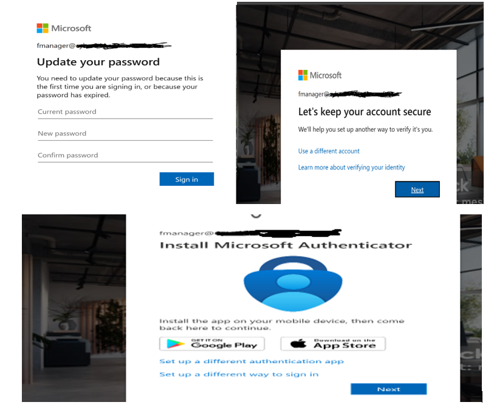

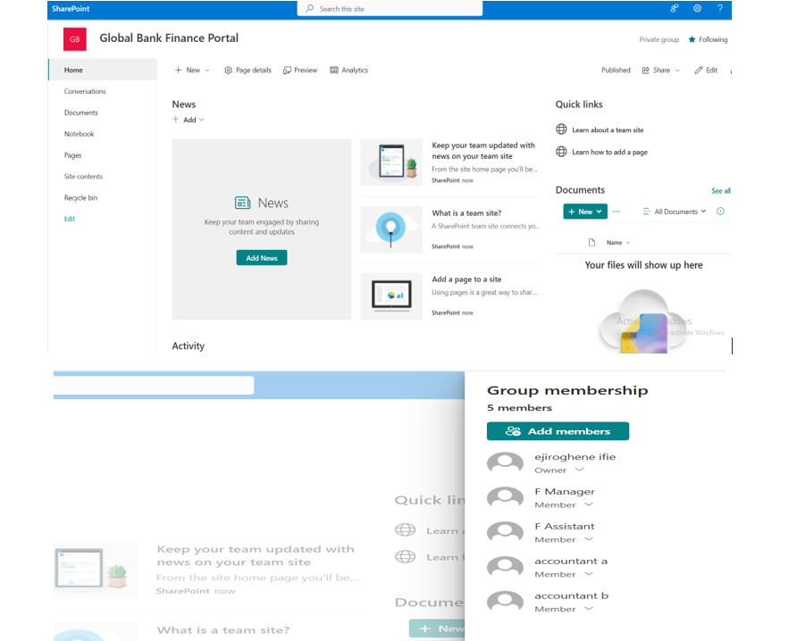

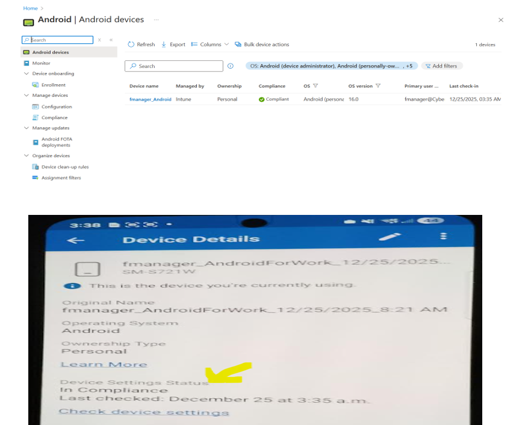

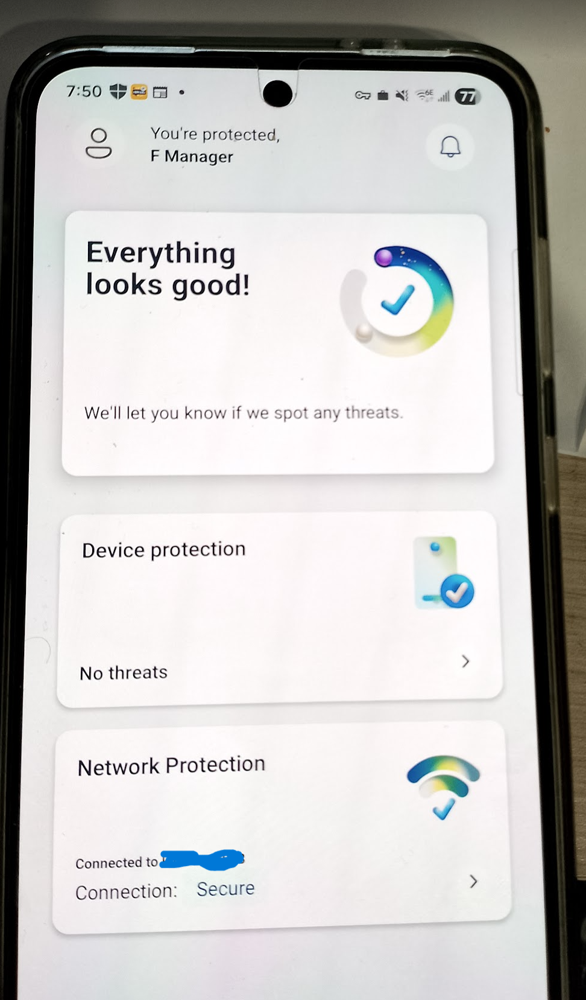

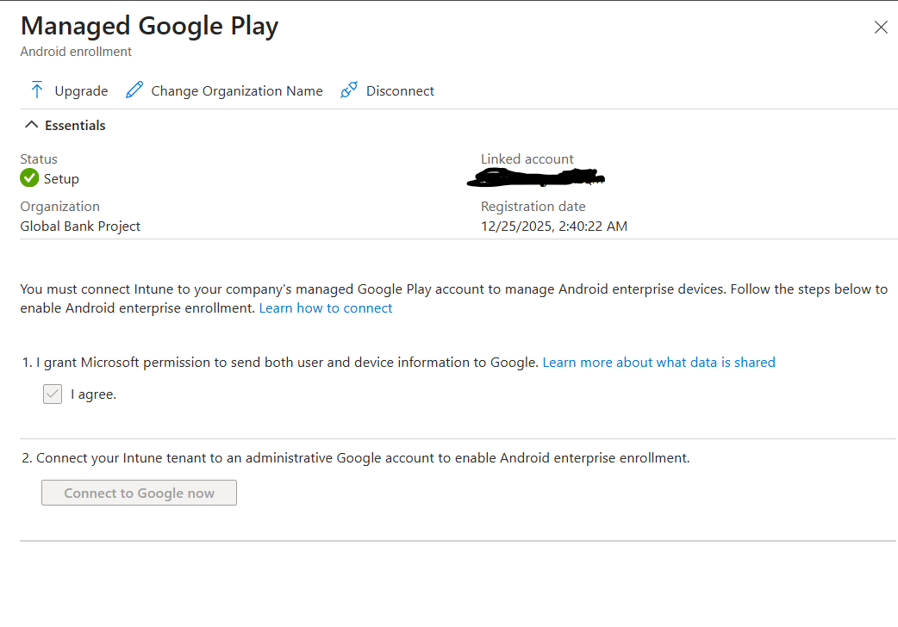

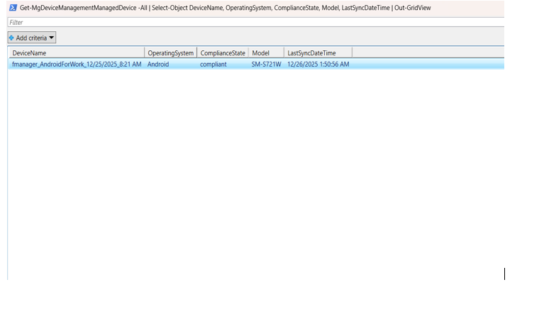

## Repository Contents
- `/images/` – All verification screenshots above
- `/scripts/audit-devices.ps1` – PowerShell script for Intune device audit

This project showcases practical ability to deliver secure M365 solutions. Feedback welcome!
